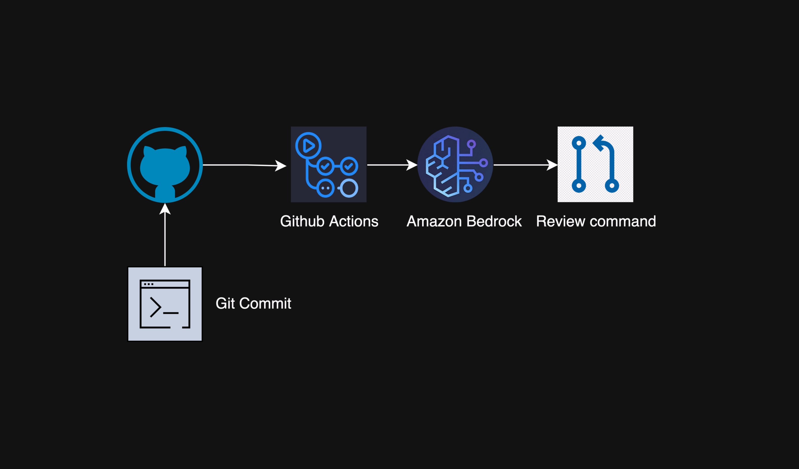

# AI Code Review GitHub Action

This repository contains a GitHub Action that automatically performs AI-powered code reviews on pull requests. The system leverages Amazon Bedrock to provide intelligent feedback on code changes.

## Features

- Automated code review comments on pull requests
- Supports multiple file types:
  - Python (.py)
  - Terraform (.tf, .tfvars)
  - HashiCorp Configuration Language (.hcl)
  - YAML (.yaml, .yml)
- Line-by-line code analysis
- Intelligent feedback using Amazon Bedrock
- Automatic comment posting on pull requests

## Setup

### Prerequisites

- AWS account with access to Amazon Bedrock
- GitHub repository with pull request workflow
- Appropriate IAM roles and permissions configured

### Configuration

1. Required variables
   - AWS_ROLE_NAME - AWS role with appropriate permissions to execute bedrock commands
   - AWS_REGION - Region to connect bedrock client

2. Required GitHub Secrets:
   - `REPO_CREATION_TOKEN`: GitHub token with permissions to comment on pull requests

3. Enable access to Amazon Bedrock(https://docs.aws.amazon.com/bedrock/latest/userguide/model-access-modify.html) claude-3-sonnet model. 


### Best Practices

1. Enable model invocation logging(https://docs.aws.amazon.com/bedrock/latest/userguide/model-invocation-logging.html#model-invocation-logging-console) to collect invocation logs, model input data, and model output data for all invocations.

2. Setup Amazon Bedrock Guardrails(https://aws.amazon.com/bedrock/guardrails/) to safeguards the application.

3. Github actions role should have the invoke model permssion.

```
{
    "Version": "2012-10-17",
    "Statement": [
        {
            "Effect": "Allow",
            "Action": [
                "bedrock:InvokeModel"
            ],
            "Resource": [
                "arn:aws:bedrock:<region>:<account-id>:model/anthropic.claude-3-sonnet-<version>"
            ]
        }
    ]
}
```


## Architecture Diagram



### Workflow Configuration

The action is triggered on:
- Pull request opens
- Pull request synchronization (new commits)

## How It Works

1. When a pull request is created or updated, the workflow automatically triggers
2. The action checks for changes in supported file types
3. For each changed file:
   - Retrieves the file content
   - Performs AI analysis using Amazon Bedrock
   - Posts the review comments on the pull request

## File Structure

.github/workflows/

|-- ai.yml                # GitHub Action workflow configuration

|-- ai_code_review.py     # Main Python script for code review

|-- prompt.txt            # AI analysis prompt template


## Dependencies

- Python 3.10
- Required Python packages:
  - PyGithub
  - boto3
  - pylint

## Contributing

1. Fork the repository
2. Create a feature branch
3. Commit your changes
4. Push to the branch
5. Create a new Pull Request

## Security

- AWS credentials are handled securely through GitHub Actions
- All sensitive information is stored in GitHub Secrets
- Uses secure AWS role assumption for authentication


## Support

This README provides a comprehensive overview of your AI Code Review system.

## Notes
 GitHub integration with Amazon Q is currently in development. Once this native integration is released, custom solutions for connecting GitHub with Amazon Q will become redundant.